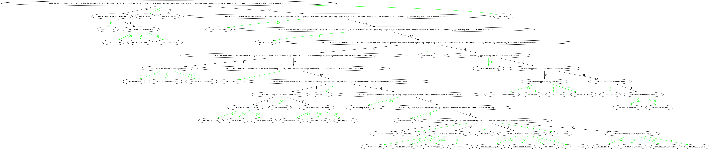

# benepar_nx

NetworkX graph from [Berkeley neural parser](https://github.com/nikitakit/self-attentive-parser) constituency parse

## Getting started , or see demo.ipynb

FIXME: get benepar 

```bash
pip install benepar && \
python -c "import benepar; benepar.download('benepar_en3')"
```

and maybe spaCy model

```bash 
python -m spacy download en_core_web_md
```

Add benepar to the pipeline 

```python
import spacy
md_benepar = spacy.load('en_core_web_md')
import benepar # for add_pipe('benepar'...

md_benepar.add_pipe('benepar', config={'model': 'benepar_en3'})
```

parse sentences:

```python
doc = md_benepar('In the fourth quarter, we closed on the transformative acquisitions of Larry H. Miller and Total Care Auto, powered by Landcar, Kahlo Chrysler Jeep Dodge, Arapahoe Hyundai-Genesis and the Stevinson Automotive Group, representing approximately $6.6 billion in annualized revenue.')
```

and create graph for the sentence:

```python
from benepar_nx.constituency_parse import create_constituency_parse_graph

s = list(doc.sents)[0]
G = create_constituency_parse_graph(s)
```

## Draw constituency parse graph

Get graphviz , GNU sed and pydot

```bash
brew install graphviz gnu-sed && \
pip install pydot
```

then

```python 
from networkx.drawing.nx_pydot import write_dot
write_dot(G, 'G.dot')
```

that will write graph like this [G.dot](./G.dot) and 

```bash
gsed -e 's/label=,/label=","/g' G.dot | dot -Tpng > output.png
```



## Hacking 

```bash
pip install --editable .
```
